# Voltivarius Komandasının Hesabatı

[](https://wro-association.org/wp-content/uploads/WRO-2024-Future-Engineers-Self-Driving-Cars-General-Rules.pdf)
[](https://www.youtube.com/playlist?list=PLiso-udvas0o-0Et_wnVIpQN-5FDyN6-4)

Bizim robotumuz **Raspberry Pi** bir-lövhəli kompüter ilə avtonom sürüş edir. Maneələri və hərəkətini təyin etmək üçün lidar, kamera, giroskop və məsafə sensorlarından istifadə edir. Robotun hərəkət etməsi üçün arxasında bir motor və bu motora qoşulmuş iki təkər vardır. Dönməsi üçünsə robotun qabağındakı servo motorundan və **Ackermann idarəetmə sistemindən** yararlanılır.

<h3>Komandamız</h3>

<table cellspacing="0" cellpadding="0" style="margin:0; padding:0; border-collapse:collapse;">
  <tr>
    <td style="margin:0; padding:0;">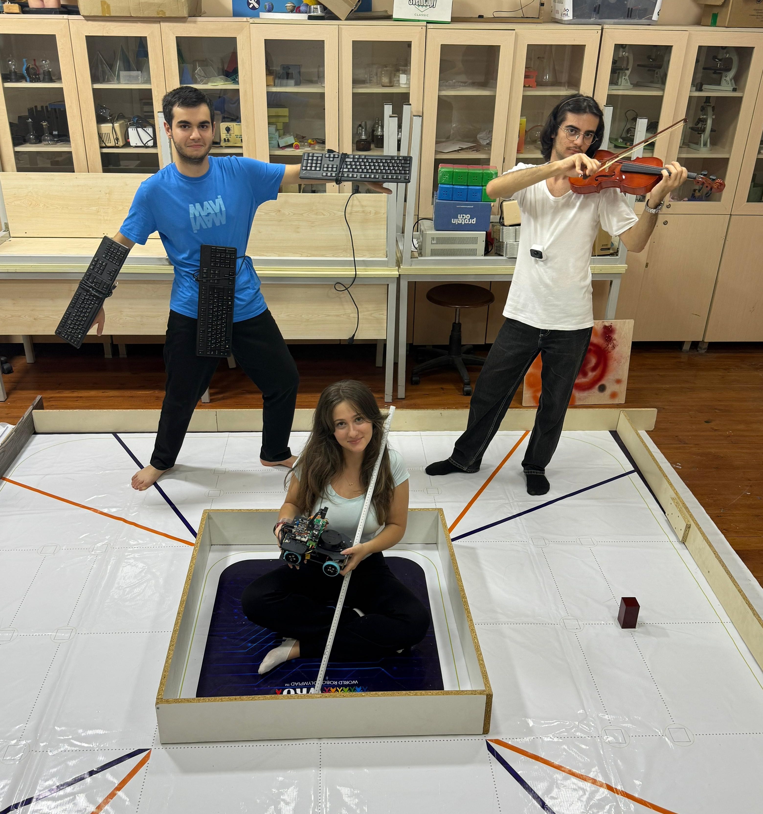<br></td>
    <td>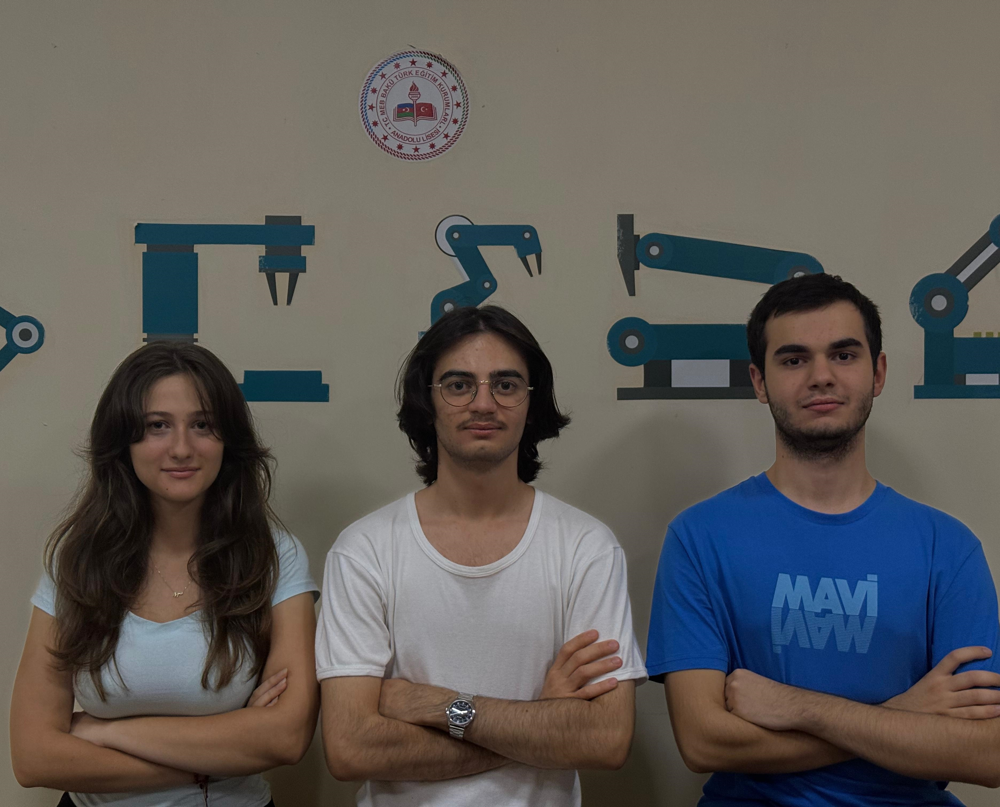<br></td>
  </tr>
</table>

Komandamız **Əhməd Qəmbərli** (Proqramlaşdırma və strategiyanın təyin olunması; [ehmedqemberli09](mailto:ehmedqemberli09@gmail.com); rəsmi şəkildə sağda), **Melisa Yıldız** (Ümumi dizayn; [melisa.17.yildiz](mailto:melisa.17.yildiz@gmail.com); rəsmi şəkildə solda) və **Eyüp Şenal** (Elektronika, mexanika, detalların print olması və işlədilən məhsullar üçün bazar araşdırması; [arduinoaz2022](mailto:arduinoaz2022@gmail.com); rəsmi şəkildə mərkəzdə).

<h3>Robotumuz</h3>

<table cellspacing="0" cellpadding="0" style="margin:0; padding:0; border-collapse:collapse;">
  <tr>
    <td align="center" colspan="2">
      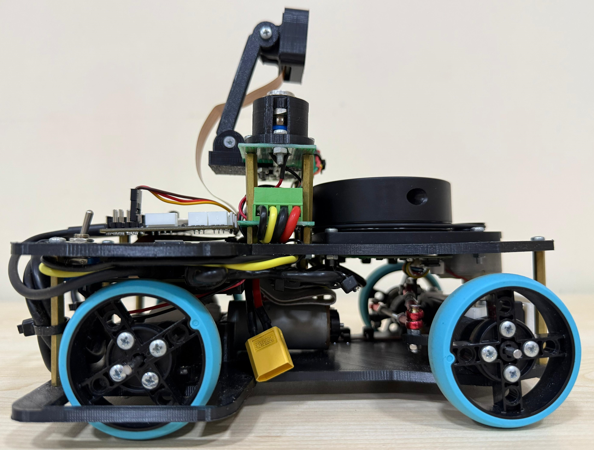<br>
      <b>Sağ</b>
    </td>
    <td align="center" colspan="2">
      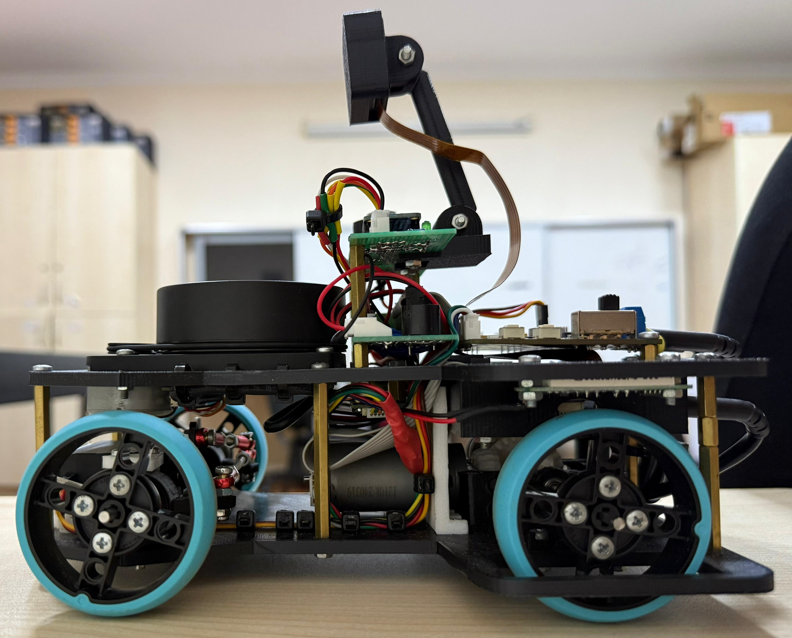<br>
      <b>Sol</b>
    </td>
  </tr>
  <tr>
    <td align="center">
      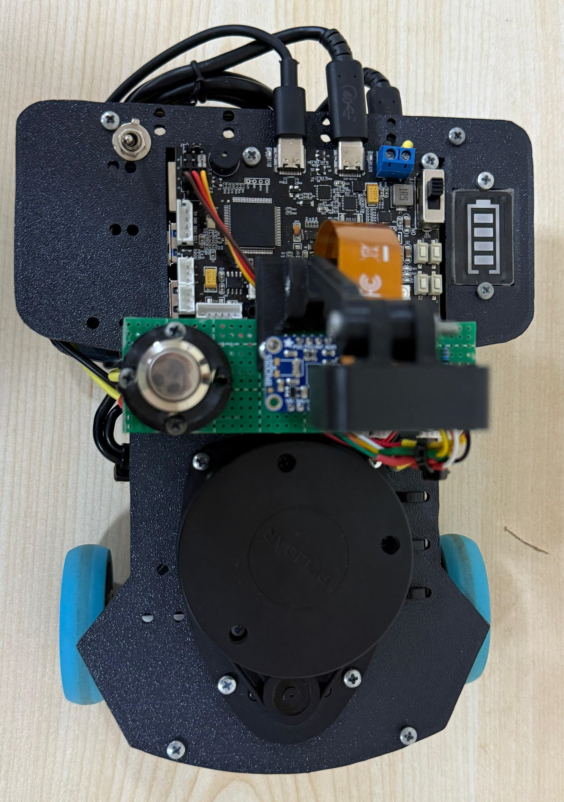<br>
      <b>Üst</b>
    </td>
    <td align="center">
      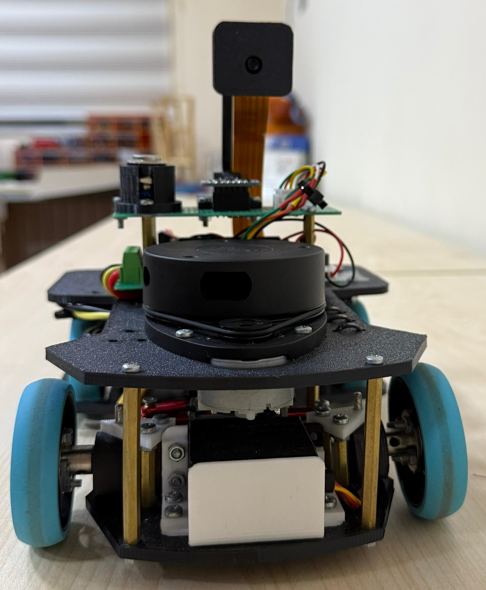<br>
      <b>Qabaq</b>
    </td>
    <td align="center">
      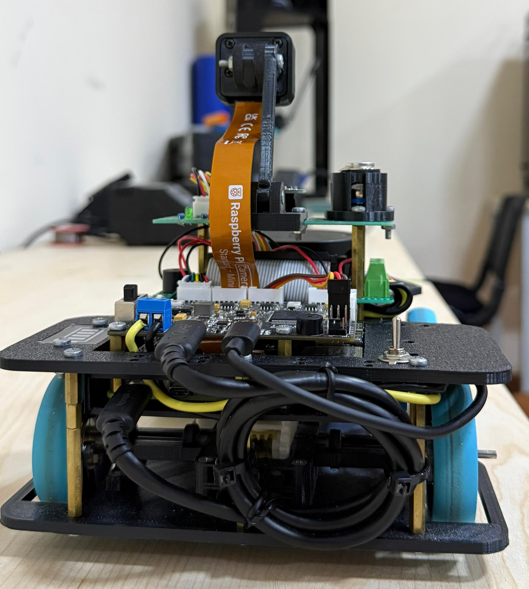<br>
      <b>Arxa</b>
    </td>
    <td align="center">
      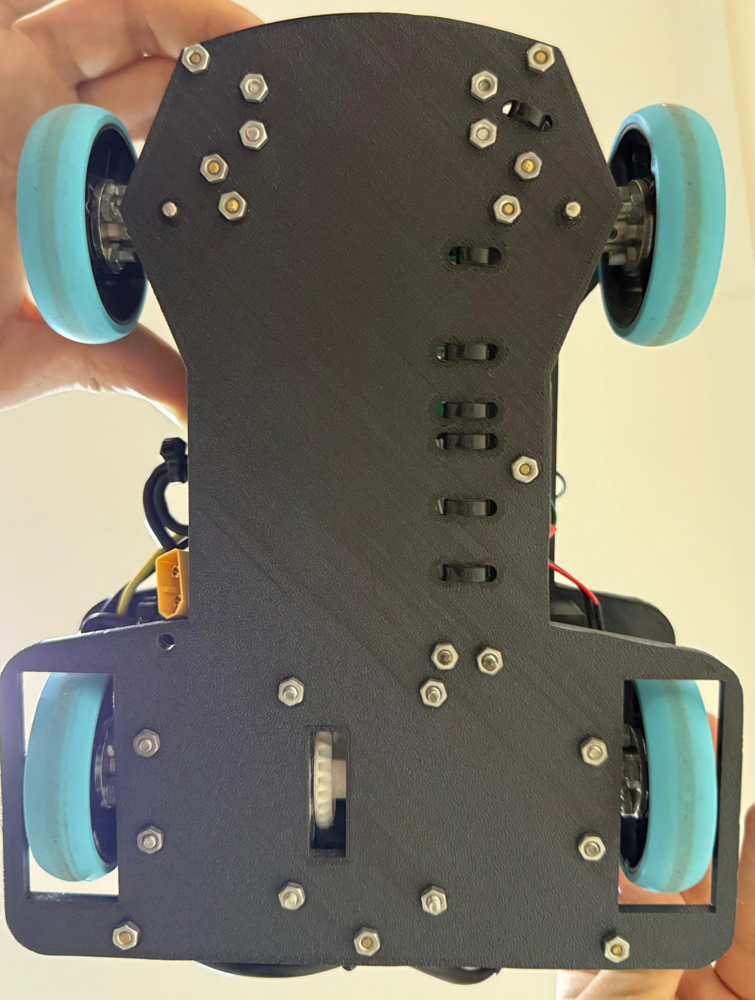<br>
      <b>Alt</b>
    </td>
  </tr>
</table>

Robotumuz maneə mərhələsi üçün effektiv alqoritmdən istifadə edir. Belə ki, ilk tur bizim robot üçün öyrənmə turudur və biz bu turu yavaş yerinə yetiririk. Bu turda hədəfimiz bütün maneələrin rəngini düzgün görmək və maneələrə toxunmamaqdır. Bu turda maneələrin rəngi yadda saxlanılır. Buna görə də ikinci və üçüncü turlarda maneələrin rənginin oxunmasına ehtiyac qalmır. Beləcə birinci tur üçün `70 saniyə`, ikinci və üçüncü tur üçünsə sadəcə `30-35 saniyə` xərcləyirik.

### Hesabat Mündəricatı

### Mündəricat

- [Voltivarius Komandasının Hesabatı](#voltivarius-komandasının-hesabatı)
- [Komandamız](#komandamız)
- [Robotumuz](#robotumuz)
- [Elektronika](#robot-elektronikası)
  - [Sistemə baxış](#sistemə-baxış)
  - [Əsas komponentlər](#raspberry-pi-5)
    - [Raspberry Pi 5 və Pico](#raspberry-pi-5)
    - [LiDAR və Kamera](#lidar-sensor-rplidar-a1m8)
    - [IMU və Ultrasonik sensorlar](#gyroskop-imu-sensoru--adafruit-bno055)
  - [Enerji və qoruma sistemi](#batareyanın-xüsusiyyəti)
- [Mexanika](#mexanika-bölməsi)
  - [Əsas təkmilləşdirmələr](#əsas-təkmilləşdirmələr)
  - [Ölçülər və balans](#ölçülər-və-montaj-məntiqi)
  - [Mühərriklər və yerləşdirilməsi](#motor-növləri-və-xüsusiyyətləri)
  - [Sensorların mövqeləri](#lidar-və-kamera)
- [Proqram təminatı](#proqram-mühitinin-hazırlanması)
  - [Konfiqurasiya və paketlər](#raspberry-pi-konfiqurasiyası)
  - [Kodun test edilməsi](#kodun-işlədilməsi-və-test-edilməsi)
- [Strategiya](#strategiyanın-izahı)
- [Robotun videoları](#robotun-videoları)

# Robot elektronikası
### Materialların siyahısı

<table>
  <tr>
    <th>Komponentlər</th><th>Şəkil</th>
    <th>Komponentlər</th><th>Şəkil</th>
  </tr>

  <tr>
    <td>Raspberry Pi 5 x 1</td><td>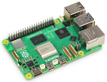</td>
    <td>Motor Sürücü x 1</td><td>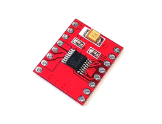</td>
  </tr>

  <tr>
    <td>RPLidar-A1M8 x 1</td><td>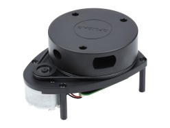</td>
    <td>BNO055 x 1</td><td>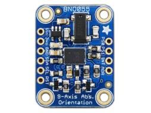</td>
  </tr>

  <tr>
    <td>3s Li-Po x 1</td><td>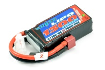</td>
    <td>IMAX B6AC batareya doldurucu x 1</td><td>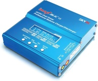</td>
  </tr>

  <tr>
    <td>MG995 Servo Motor x 1</td><td>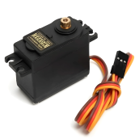</td>
    <td>Raspberry Pi Kamera Modulu 3 x 1</td><td>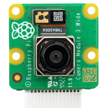</td>
  </tr>

  <tr>
    <td>Enkoder mühərriki x 1</td><td>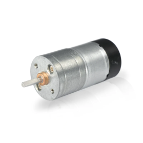</td>
    <td>Perfboard x 1</td><td>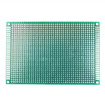</td>
  </tr>

  <tr>
    <td>Dəyişdiricini ON-OFF x 1</td><td>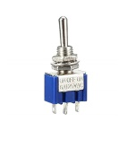</td>
    <td>2,54 mm JST-XH Bağlayıcı Kişi x 5</td><td>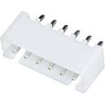</td>
  </tr>

  <tr>
    <td>2,54 mm JST-XH Konnektor Dişi x 5</td><td>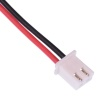</td>
    <td>XT-60 x 1</td><td>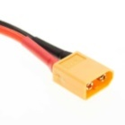</td>
  </tr>

  <tr>
    <td>2.54 mm Pin Başlığı Dişi x 1</td><td>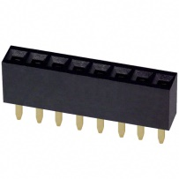</td>
    <td>Düymə x 1</td><td>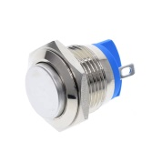</td>
  </tr>

  <tr>
    <td>Sigorta x 1</td><td>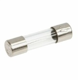</td>
    <td>Sigorta Tutucusu x 1</td><td>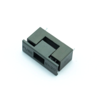</td>
  </tr>

  <tr>
    <td>10K ohm Rezistor x 1</td><td>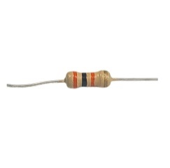</td>
    <td>330ohm rezistor x 2</td><td></td>
  </tr>

  <tr>
    <td>GPIO kabeli x 1</td><td>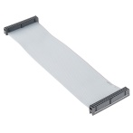</td>
    <td>Batareya monitoru x 1</td><td></td>
  </tr>

  <tr>
    <td>Bilyalı birləşmə x 4</td><td>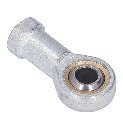</td>
    <td>3 mm sərt flanşlı mufta x 4</td><td>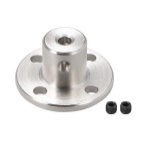</td>
  </tr>

  <tr>
    <td>50 mm Standoff Qadın-Kişi x 6</td><td></td>
    <td>20mm Standoff Qadın - Kişi x 4</td><td>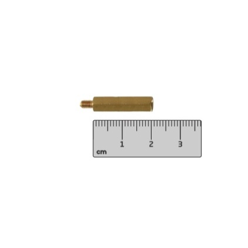</td>
  </tr>

  <tr>
    <td>3 mm mil 7 sm x 2</td><td>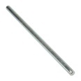</td>
    <td>Li-Po Batareya Test Cihazı Gərginlik Monitoru x 1</td><td>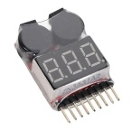</td>
  </tr>

  <tr>
    <td>Filament 1 kq x 1</td><td>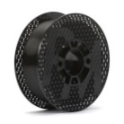</td>
    <td>M3 Neylon Daxiletmə Kilid Qoz x 2</td><td>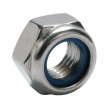</td>
  </tr>

  <tr>
    <td>Type-c - Type-c Kabel x 1</td><td>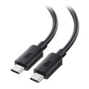</td>
    <td>Type-c - USB Kabel x 1</td><td>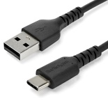</td>
  </tr>

  <tr>
    <td>32 GB Yaddaş Kartı x 1</td><td>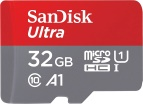</td>
    <td>Aktiv soyuducu x 1</td><td>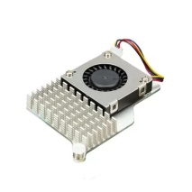</td>
  </tr>

  <tr>
    <td>Avtomobil Şassisinin Aşağı hissəsi x 1</td><td>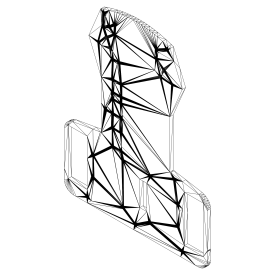</td>
    <td>Avtomobilin şassisinin yuxarı hissəsi x 1</td><td>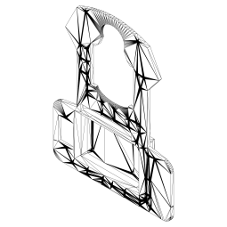</td>
  </tr>

  <tr>
    <td>Motor qutusu x 1</td><td>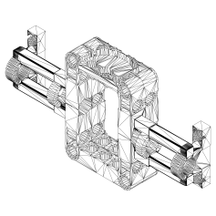</td>
    <td>Motor qutusu təkəri x 1</td><td>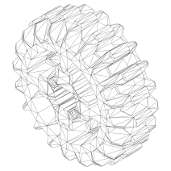</td>
  </tr>

  <tr>
    <td>Motor qutusu Təkər 2 x 1</td><td>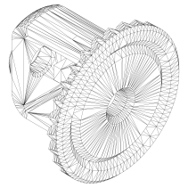</td>
    <td>Sürət qutusu təkəri x 4</td><td>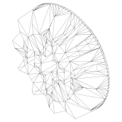</td>
  </tr>

  <tr>
    <td>Servo braket x 1</td><td>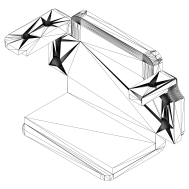</td>
    <td>Təkər Sükan Sistemi x 2</td><td>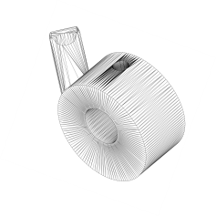</td>
  </tr>

  <tr>
    <td>Ön Təkər Tutacağı x 2</td><td>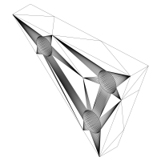</td>
    <td>Kabel tutacağı x 1</td><td>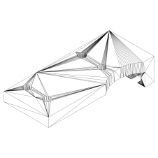</td>
  </tr>

  <tr>
    <td>Düymə Sahibi x 1</td><td>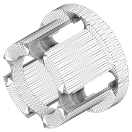</td>
    <td>Kamera Tutacağı x 1</td><td></td>
  </tr>

  <tr>
    <td>XL-4015 x 2</td><td></td>
    <td>HCSR-04 x 1</td><td></td>
  </tr>
</table>

### Sistemə baxış
### Elektron Sistemin Arxitekturası

- **Raspberry Pi 5:** Sensor məlumatlarını toplayır, emal edir və aktuator əmrləri yaradır.
- **Raspberry Pi Pico + DRV8833:** DC motor və servoları idarə edir, enkoder məlumatlarını geri ötürür.
- **Enkoderli DC Motor:** İrəli-geri hərəkəti təmin edir və sürət/mövqe məlumatı verir.
- **Servo Motor:** Robotun dönüşlərini idarə edir.

### İş Prinsipi
-	Enerji Li-Po 3S batareyadan təmin olunur.
-	Raspberry Pi 5 işə düşür və ROS qovşaqları aktivləşir.
-	Sensorlardan (lidar, kamera) məlumat alınır.
-	Pi 5 məlumatları emal edir və qərar qəbul edir.
-	Əmrlər Pico vasitəsilə DRV8833-ə ötürülür.
-	Motorlar və servo hərəkəti icra edir.
-	Sistem real vaxt rejimində dövr edir.

<h3>Raspberry Pi 5</h3>

<table style="width:80%; border-collapse:collapse;">
  <tr>
    <td rowspan="4" style="width:400px; text-align:center; vertical-align:middle; padding:0; margin:0;">
      
    </td>
    <td>USB</td>
    <td>LiDAR sensoru və əlavə cihazların birləşdirilməsi</td>
  </tr>
  <tr>
    <td>CSI Kamera Poru:</td>
    <td>Kamera Modulu 3 üçün qoşulma</td>
  </tr>
  <tr>
    <td>GPIO sancaqları</td>
    <td>Başlat düyməsi, güc açarı, kodlayıcı və digər sensor siqnalları</td>
  </tr>
  <tr>
    <td>İş gərginliyi</td>
    <td>5V DC, minimum 3A</td>
  </tr>
</table>

Raspberry Pi 5 robotun əsas nəzarətçisi kimi istifadə olunan yüksək performanslı bir lövhəli kompüterdir. Sensor məlumatlarını emal edir, aktuatorlara nəzarət siqnalları yaradır və ümumi sistem əməliyyatlarını ROS üzərindən idarə edir.

Robotumuzda rolu:

- RPLiDAR A1M8 və Kamera Modulu 3-dən məlumatların emalı
- Raspberry Pi Pico vasitəsilə motorların və servoların idarəsi
- Başlat düyməsi və güc açarı üçün GPIO istifadə

Güc Tələbləri:

- Li-Po 3S 1300 mAh batareya və gərginlik tənzimləyicisi ilə təchiz olunur
- Periferik cihazlar üçün sabit enerji təmin edir

<h3>Raspberry Pi Pico + DRV8833 Motor Sürücü</h3>

<table style="width:80%; border-collapse:collapse;">
  <tr>
    <td rowspan="5" style="width:300px; text-align:center; vertical-align:middle; padding:0; margin:0;">
      
    </td>
    <td>RP2040 mikronəzarətçi (Pico)</td>
  </tr>
  <tr>
    <td>Dual H-Bridge motor sürücü (DRV8833)</td>
  </tr>
  <tr>
    <td>Enkoder oxunuşları üçün dəstək</td>
  </tr>
  <tr>
    <td>PWM ilə sürət və istiqamət idarəsi</td>
  </tr>
  <tr>
    <td>Kompakt ölçü və aşağı enerji istehlakı</td>
  </tr>
</table>

Raspberry Pi Pico mikronəzarətçisi DRV8833 motor sürücüsü ilə birlikdə DC mühərrikləri və servoları idarə etmək üçün istifadə olunur. Əsas nəzarətçi olan Raspberry Pi 5-dən gələn əmrləri qəbul edir və aktuator hərəkətlərinə çevirir.

Mühərrik Birləşmələri
-	2 kanal DC mühərrik idarəsi
-	PWM siqnalları ilə sürət və istiqamət nəzarəti
-	Enkoderlərdən sürət və mövqe rəyi

Güc Tələbləri
-	**DRV8833:** 2.7–10.8V giriş
-	**Raspberry Pi Pico:** 3.3V işləmə gərginliyi

<h3>Mühərriklər və Servo Motor</h3>

<h4>Mühərrik</h4>

<table style="width:80%; border-collapse:collapse;">
  <tr>
    <td rowspan="5" style="width:400px; text-align:center; vertical-align:middle; padding:0; margin:0;">
      
    </td>
    <td>İş gərginliyi</td>
    <td>5–12V DC</td>
  </tr>
  <tr>
    <td>Enkoder gərginliyi</td>
    <td>3.3–5V DC</td>
  </tr>
  <tr>
    <td>Yüksüz cərəyan</td>
    <td>200 mA, nominal: 300 mA, dayanma: 800 mA</td>
  </tr>
  <tr>
    <td>Sürət</td>
    <td>~1000 RPM @ 12V</td>
  </tr>
  <tr>
    <td>Ölçü</td>
    <td>25 × 71 mm, Çəki: 95 q</td>
  </tr>
</table>

<h4>Servo</h4>

<table style="width:80%; border-collapse:collapse;">
  <tr>
    <td rowspan="4" style="width:400px; text-align:center; vertical-align:middle; padding:0; margin:0;">
      
    </td>
    <td>Fırlanma bucağı</td>
    <td>30°–160°</td>
  </tr>
  <tr>
    <td>Sürət</td>
    <td>0.15 s/60°</td>
  </tr>
  <tr>
    <td>Tork</td>
    <td>13–15 kg·cm</td>
  </tr>
  <tr>
    <td colspan="2">Metal dişli, yüksək davamlılıq</td>
  </tr>
</table>

Əlaqələr və İnteqrasiya
-	**DC mühərriklər:** DRV8833 vasitəsilə idarə olunur
-	**Enkoderlər:** Pico üzərindən Pi 5-ə məlumat göndərir
-	**Servo:** PWM ilə nəzarət

Güc Tələbləri
-	**DC mühərriklər:** 5–12V DC
-	**Servo:** 4.8–6V DC

Nəzarət Siqnalları
-	**DC mühərriklər:** PWM + Enkoder rəyi
-	**Servo:** PWM ilə mövqe bucağı idarəsi

<h3>LiDAR Sensor (RPLIDAR A1M8)</h3>

<table style="width:80%; border-collapse:collapse;">
  <tr>
    <td rowspan="5" style="width:330px; text-align:center; vertical-align:middle; padding:0; margin:0;">
      
    </td>
    <td>Ölçü</td>
    <td>98.5 × 70 × 60 mm</td>
  </tr>
  <tr>
    <td>Çəki</td>
    <td>170 q</td>
  </tr>
  <tr>
    <td>Tarama diapazonu</td>
    <td>6 m</td>
  </tr>
  <tr>
    <td>Nümunə götürmə sürəti</td>
    <td>8000/s</td>
  </tr>
  <tr>
    <td>Tarama tezliyi</td>
    <td>2–10 Hz (PWM ilə)</td>
  </tr>
</table>

SLAMTEC RPLiDAR A1M8, xəritəçəkmə və naviqasiya üçün nəzərdə tutulmuş 360° 2D lazer skaneridir. Yüngül, etibarlı və mobil robotlar üçün optimallaşdırılmışdır.

Əlaqələr
-	USB interfeysi ilə Raspberry Pi 5-ə qoşulur
-	PWM ilə motor sürəti tənzimlənir

Güc Tələbləri
-	5V DC (USB)
-	Aşağı enerji istehlakı

<h3>Kamera (Raspberry Pi Camera Module v3)</h3>

<table style="width:80%; border-collapse:collapse;">
  <tr>
    <td rowspan="4" style="width:280px; text-align:center; vertical-align:middle; padding:0; margin:0;">
      
    </td>
    <td>Çözünürlük</td>
    <td>4608 × 2592 (11.9 MP)</td>
  </tr>
  <tr>
    <td>Piksel</td>
    <td>1.4 µm</td>
  </tr>
  <tr>
    <td>Video</td>
    <td>1080p50, 720p100, 480p120</td>
  </tr>
  <tr>
    <td>Ölçü</td>
    <td>25 × 24 × 11.5 mm, Çəki: 3 q</td>
  </tr>
</table>

Sony IMX708 sensorlu 11.9 MP kamera modulu, yüksək keyfiyyətli təsvir və video çəkmə imkanına malikdir. HDR və PDAF avtofokus dəstəkləyir.

Əlaqələr
-	CSI-2 portu ilə Raspberry Pi 5-ə qoşulur

Güc Tələbləri
-	CSI interfeysi üzərindən enerji alır

<h3>Gyroskop (IMU) Sensoru – Adafruit BNO055</h3>

<table style="width:80%; border-collapse:collapse;">
  <tr>
    <td rowspan="4" style="width:310px; text-align:center; vertical-align:middle; padding:0; margin:0;">
      
    </td>
    <td>9 DOF</td>
    <td>Akselerometr, Giroskop, Maqnitometr</td>
  </tr>
  <tr>
    <td>Çıxış</td>
    <td>Euler bucaqları, Kvaternion, Vektorlar</td>
  </tr>
  <tr>
    <td>Tezlik</td>
    <td>100 Hz-ə qədər</td>
  </tr>
  <tr>
    <td>Ölçü</td>
    <td>20 × 27 × 4 mm, Çəki: 3 q</td>
  </tr>
</table>

Bosch BNO055 əsaslı IMU sensoru daxili sensor birləşməsi ilə dəqiq oriyentasiya məlumatı təqdim edir.

Əlaqələr
-	**Rabitə:** I²C (0x28 və ya 0x29), UART dəstəyi
-	Reset və Interrupt pinləri

Güc Tələbləri
-	**İş gərginliyi:** 3.3V (5V tolerant I²C girişləri ilə)

<h3>Xüsusi PCB Dizaynı</h3>

Bu xüsusi idarəetmə lövhəsi Raspberry Pi 5 və robot sisteminin periferik komponentləri arasında əsas interfeys kimi hazırlanmışdır. O, modullar arasında mütəşəkkil və təhlükəsiz əlaqəni təmin edən sensor birləşmələrini, istifadəçinin qarşılıqlı əlaqə elementlərini (LED, düymə, səs siqnalı) və enerji idarəetmə komponentlərini birləşdirir.

**Bir qatlı perfboard (prototip lövhəsi)** üzərində qurulmuşdur və aşağıdakı əsas komponentləri ehtiva edir:
-	**İki LED (qırmızı və yaşıl):** Vəziyyət və xəbərdarlıq göstəriciləri kimi istifadə olunur.
-	**Bir siqnal:** Səsli xəbərdarlıqlar verir.
-	**Bir təkan düyməsi:** İstifadəçi girişinə nəzarət.
-	**Bir qoruyucu:** Həddindən artıq cərəyandan qorunma.
-	**Bir giroskop sensoru (BNO055 IMU):** Oriyentasiya və hərəkət sensoru.
-	**Bir açar:** Gücü yandırma/söndürmə nəzarəti.
-	**Raspberry Pi 5 GPIO əlaqələri:** Sistemə nəzarət və rabitə üçün.

Perfboardda elektrik xətləri qalın mis naqillərlə, siqnal xətləri isə daha incə naqillərlə, cərəyanı idarə etmək qabiliyyətini təmin etmək və müdaxiləni minimuma endirmək üçün çəkilir.

Bağlantı nöqtələri
-	**Güc Girişi:** 6–14 V xarici enerji təchizatı ilə işləyir .
-	**Raspberry Pi 5 GPIO:** LEDlər, düymələr, səs siqnalları və sensor üçün birbaşa bağlantılar.
-	**Sensor bağlantısı:** BNO055 IMU I²C interfeysi (SCL, SDA) vasitəsilə Raspberry Pi 5-ə qoşulur .
-	**Bağlayıcılar:** JST və pin başlıq bağlayıcıları həm güc, həm də siqnal interfeysləri üçün istifadə olunur.

İstehsal və montaj qeydləri
-	Dövrə əl ilə perfboard (prototip lövhəsi) üzərində yığılır .
-	Elektrik xətləri yüksək cərəyan üçün daha qalın naqillərlə lehimlənir, siqnal xətləri isə daha nazik naqillərdən istifadə edir.
-	Prototip olaraq bu dizayn tez modifikasiyalara və sınaqlara imkan verir.
-	Uzunmüddətli və davamlı istifadə üçün, kütləvi istehsalda lehim maskası və səthi bitirmə ilə FR4 əsaslı PCB- yə keçmək tövsiyə olunur.

<h3>Ultrasonik Sensor (HC-SR04)</h3>

<table style="width:80%; border-collapse:collapse;">
  <tr>
    <td rowspan="7" style="width:275px; text-align:center; vertical-align:middle; padding:0; margin:0;">
      
    </td>
    <td>Ölçmə diapazonu</td>
    <td>2 sm – 400 sm</td>
  </tr>
  <tr>
    <td>Ölçmə dəqiqliyi</td>
    <td>±3 mm</td>
  </tr>
  <tr>
    <td>Ölçmə bucağı</td>
    <td>~15°</td>
  </tr>
  <tr>
    <td>İş gərginliyi</td>
    <td>5V DC</td>
  </tr>
  <tr>
    <td>Ölçülər</td>
    <td>45 × 20 × 15 mm</td>
  </tr>
  <tr>
    <td>Çəki</td>
    <td>9 g</td>
  </tr>
  <tr>
    <td colspan="2">Sürətli cavab müddəti (təxminən 10 µs trigger impulsu)</td>
  </tr>
</table>

HC-SR04, maneələrin aşkarlanması və yaxın məsafələrin ölçülməsi üçün istifadə olunan ucuz və geniş yayılmış ultrasonik məsafə sensorudur. O, səs dalğalarının əks olunma prinsipinə əsaslanır və qısa məsafəli obyekt aşkarlanmasında yüksək dəqiqlik təmin edir.

Əlaqələr
-	**VCC (5V):** Raspberry Pi və ya RRC Lite Controller-in 5V xəttinə qoşulur.
-	**GND:** Ümumi torpaq xəttinə qoşulur.
-	**TRIG (Trigger):** Raspberry Pi GPIO pininə çıxış siqnalı üçün qoşulur.
-	**ECHO:** Raspberry Pi GPIO pininə giriş siqnalı üçün qoşulur.

> Qeyd: ECHO pinindən gələn 5V siqnalı Raspberry Pi GPIO (3.3V tolerant) üçün uyğunlaşdırmaq məqsədilə gərginlik bölücü rezistor istifadə olunmalıdır.

Güc Tələbləri
-	**İş gərginliyi:** 5V DC
-	**Tipik cərəyan istehlakı:** 15 mA

<h3>Batareyanın Xüsusiyyətləri (Gərginlik, Tutum, C Qiyməti)</h3>

<table style="width:80%; border-collapse:collapse;">
  <tr>
    <td rowspan="8" style="width:400px; text-align:center; vertical-align:middle; padding:0; margin:0;">
      
    </td>
    <td>Gərginlik</td>
    <td>11.1 V (nominal)</td>
  </tr>
  <tr>
    <td>Tutum</td>
    <td>1300 mAh</td>
  </tr>
  <tr>
    <td>Hüceyrə sayı</td>
    <td>3S (3 hüceyrə, seriyalı)</td>
  </tr>
  <tr>
    <td>Boşaltma dərəcəsi</td>
    <td>50C davamlı / 100C pik (maksimum 10 s)</td>
  </tr>
  <tr>
    <td>Çəki</td>
    <td>110 g</td>
  </tr>
  <tr>
    <td>Ölçülər</td>
    <td>74 × 33 × 21 mm</td>
  </tr>
  <tr>
    <td>Boşaltma konnektoru</td>
    <td>XT60 (qara)</td>
  </tr>
  <tr>
    <td>Doldurma konnektoru</td>
    <td>JST-XHR (ağ)</td>
  </tr>
</table>

Layihədə istifadə olunan enerji mənbəyi — yüksək cərəyan tələb edən robototexnika, dron və müdafiə sistemləri üçün nəzərdə tutulmuş JetFire 3S Li-Po batareyasıdır. Bu batareya yüksək boşalma dərəcəsi və etibarlı hüceyrə quruluşu ilə sistemin sabit və uzunmüddətli işləməsini təmin edir.

<h3>Güc Paylama Diaqramı və Mühafizə Sistemləri</h3>

11.1V 3S Li-Po batareyası bütün sistemi təmin edir. Enerji mərkəzi paylama lövhəsi vasitəsilə bölünərək yüksək cərəyan xətləri (mühərriklər, sürücülər) və aşağı cərəyan xətləri (nəzarətçilər, sensorlar) ayrılır. Bu, həm səmərəliliyi artırır, həm də sistemdə gərginlik sabitliyini təmin edir.

Gərginlik Tənzimləyiciləri və Çeviricilər (5V, 3.3V və s.)
-	**5V:** Raspberry Pi 5, LiDAR və kamera üçün təmin edilir.
-	**3.3V:** IMU və digər aşağı güclü sensorlar üçün istifadə olunur.
-	**XL4015 Çevirici:**
  - DRV8833 sürücü lövhəsi üçün 10V çıxış təmin edir.
  -	Servo motor üçün 6V çıxış təmin edir.

Səmərəlilik və enerji sabitliyi üçün keçid tənzimləyicilərindən istifadə olunub.

BMS Li-Po batareyasının təhlükəsiz işləməsini təmin edir:
-	Həddindən artıq yüklənmənin qarşısını alır,
-	Həddindən artıq boşalmadan qoruyur,
-	Qısaqapanma və qızdırma risklərini azaldır.

Balanslaşdırılmış doldurma **iMAX B6AC balans şarj cihazı** vasitəsilə həyata keçirilir.

Mühafizə Mexanizmləri (Qoruyucu, Həddindən Artıq Cərəyandan Qorunma)
-	Qoruyucular və çox qoruyucu sxemlər əlavə olunub.
-	Tərs polarite qorunması və gərginlik monitorinq modulları istifadə edilib.
-	Parazitlənmənin qarşısını almaq üçün mühərrik xətlərinə kapasitörlər qoşulub. Bu, motorların işini sabitləşdirir və siqnal qarışıqlığını minimuma endirir.

<h3>Dövrə Sxemləri</h3>

<table cellspacing="0" cellpadding="0" style="margin:0; padding:0; border-collapse:collapse;">
  <tr>
    <td style="margin:0; padding:0;"><br></td>
    <td><br></td>
  </tr>
  <tr>
    <td align="center">Raspberry Pi və sensorlar üçün dövrə sxemi</td>
    <td align="center">Raspberry Pi Pico və motor sürücü üçün dövrə sxemi</td>
  </tr>
</table>

# Mexanika Bölməsi

Yarışmaya başladıqdan bəri robotumuz hər zaman dəyişmişdir. Bunun səbəbi dəyişən elektronik dövrələr, dəyişən strategiyalara edilən adaptasiyalardır. İlk prototipimiz daha kəskin xətləri olan, kompakt və sıx şasseyə sahib idi və bu səbəbdən robot obyektlərə dəyərək hərəkət edirdi. Zamanla şassi ölçüləri genişləndi, xətləri hamarlaşdı və daha çox stabil və etibarlı struktura çevrildi.

### Əsas təkmilləşdirmələr

Robot şassi, motor və idarəetmə sistemləri optimallaşdırılmışdır. Xüsusilə stabil şassi quruluşu və sensor yerləşimi üzərində dəyişikliklər aparılmış, beləliklə robotun balansı və çevikliyi artırılmışdır. Bundan əlavə robotun kamera moduluna 4 ədəd ağ LED əlavə edilmişdir. Bu LEDlər işıqlandırmanı sabitləşdirərək ətraf işıqlandırmanın təsirini azaldır.

<br>

Robotun şassisi həm yüngül, həm də möhkəm olması üçün diqqətlə seçilmiş materiallardan hazırlanıb. Burada əsasən alüminium, PLA plastik və polikarbonatdan istifadə olunub. Bu materiallar sayəsində robot həm dayanıqlılığını qoruyur, həm də sərbəst və çevik hərəkət edə bilir.

Konstruksiya zamanı modulyarlıq və uzunömürlülük əsas prinsiplər kimi götürülüb. Şassinin forması və təbəqələri elə qurulub ki, elektrik komponentləri və sensorlar həm müdafiə altında olsun, həm də möhkəm şəkildə bərkidilsin.

Dizayn prosesi zamanı komponentlərin düzgün yerləşməsi və robotun sabit hərəkəti əsas hədəf olub. Enerji bloku, sensorlar, aktuatorlar və nəzarətçi vahidinin mövqeləri bir-birinə mane olmadan, səmərəli şəkildə yerləşdirilib. Bu yanaşma həm mexaniki, həm də elektron sistemlərin bir-birinə qarışmadan, ahəngdar şəkildə işləməsinə imkan yaradır.

### Ölçülər və Montaj Məntiqi
Robotun şassisi `28 sm` ölçüsündədir və komponentlərin yerləşdirilməsi üçün montaj deşikləri və aralayıcı standoff-lar nəzərə alınmışdır. Ümumilikdə 5 ədəd standoff istifadə olunmuşdur ki, şassinin üst və alt hissələri möhkəm şəkildə birləşdirilsin və eyni zamanda asan açılıb-bağlanma imkanı olsun. Bu, həm texniki xidmət, həm də modul dəyişdirmə proseslərini sadələşdirir.

Komponentlərin yerləşdirilməsi çox həssas şəkildə planlaşdırılmışdır:
-	Ön hissədə LIDAR,
-	Robotun ortasında Gyro sensoru,
-	Arxasında Raspberry Pi 5 və motor sürücü,
-	Ən arxa hissədə ultrasonik sensor yerləşdirilmişdir.

Bu yerləşdirmə sensorların optimal işləməsini və robotun stabil hərəkətini təmin edir. Komponentlər arasındakı məsafələr həm mexaniki müdaxiləni minimuma endirir, həm də istilik və vibrasiya kimi təsirlərin qarşısını alır.

3D Print Tövsiyəsi:
-	**İstifadə olunan filament:** PLA (Creality şirkətinə məxsus),
-	**Printer:** Sidewinder X2,
-	**Nozzle temperaturu:** 210°C,
-	**Tabla temperaturu:** 60°C,
-	Standoff aralayıcıları və vidalar şassinin möhkəmliyini və rahat montajını təmin edir.

<table cellspacing="0" cellpadding="0" style="margin:0; padding:0; border-collapse:collapse;">
  <tr>
    <td style="margin:0; padding:0;"><br></td>
    <td><br></td>
  </tr>
  <tr>
    <td colspan="2" align="center">Üst, yan və alt görünüş.</td>
  </tr>
</table>

### Motor Növləri və Xüsusiyyətləri

Robotun hərəkət və dəqiqlik tələblərinə uyğun olaraq iki əsas motor növü istifadə olunmuşdur:
-	**DC dişli mühərrikləri:** Bu mühərriklər 5–12V DC diapazonunda işləyir və yüksək tork təmin edir. Hər bir motorun cərəyan və RPM xüsusiyyətləri robotun sürət və yük daşıma qabiliyyətinə uyğun seçilmişdir. Dişli sistemi mühərrikin çıxış sürətini optimallaşdıraraq, daha hamar və dəqiq hərəkət təmin edir.
-	**Servo motorlar:** Servo motorlar robotun dönmə bucağı və dəqiq mövqe idarəsini təmin edir. Bu motorlar 4.8–6V DC ilə işləyir və yüksək tork tələb edən kiçik hərəkətlər üçün istifadə olunur. Servo motorların sürəti və dəqiqliyi robotun navigasiya və sensor yönləndirmə funksiyalarında kritik rol oynayır.

### Motorların Robot Hərəkətinə Təsiri

Motorların xüsusiyyətləri robotun ümumi performansına birbaşa təsir edir:
-	**Hərəkət sürəti:** DC mühərriklərinin RPM-i robotun sürətini təyin edir.
-	**Tork tələbləri:** Robotun şassisi və daşıdığı komponentlər nəzərə alınaraq motorlar seçilmişdir ki, həm sabit hərəkət, həm də yüklə maneələrdən keçmə imkanı təmin olunsun.
-	**Yük daşıma qabiliyyəti:** Motorlar robotun əlavə sensor və akkutator çəkisini dəstəkləyəcək gücdə olmalıdır.

### Mühərriklərin Mövqeləşdirilməsi

Motorların şassidə yerləşdirilməsi robotun balansı və hərəkət səmərəliliyi üçün diqqətlə planlaşdırılmışdır:
-	Hər bir DC motor şassinin yan hissələrinə yerləşdirilmişdir ki, torkun mərkəzə düzgün paylanması təmin olunsun.
-	Kodlayıcılar motorların düzgün oxuya bilməsi üçün mühərrik dişlilərinə yaxın, lakin hərəkət məhdudiyyətləri olmayan mövqedə quraşdırılmışdır.
-	Servo motorlar robotun xüsusi funksional hissələrinə yerləşdirilmişdir ki, hərəkət dəqiqliyi və sensor yönləndirməsi maksimal olsun.

Bu yerləşdirmə həm mexaniki balansı qoruyur, həm də sensorlardan və digər aktuatorlardan müdaxiləni minimuma endirir.


### Batareya və Ağırlıq Balansı

Robot şassisinin dizaynında batareya yalnız enerji təmin edən komponent kimi deyil, həm də ağırlıq mərkəzini optimallaşdıran element kimi nəzərə alınmışdır.
-	**Batareya yerləşimi:** 11.1V 3S Li-Po batareyası şassinin ortasına yaxın bir mövqedə yerləşdirilmişdir ki, robotun irəli-geri və yan hərəkətləri zamanı balans pozulmasın.
-	**Ağırlıq paylanması:** Bu yerləşdirmə motorlar, sensorlar və digər aktuatorların çəkisi ilə birgə robotun mərkəzi ağırlıq nöqtəsini aşağıda saxlayır, bu da daha stabil hərəkət və dönmə təmin edir.

Robotun mexaniki dizaynında enerji kabellərinin keçid trayektoriyası mühüm rol oynayır:
-	**Optimal marşrutlaşdırma:** Kabellər şassidə motorlardan, sensorlardan və Raspberry Pi-dən keçərkən həm hərəkət edən hissələrdən uzaq tutulur, həm də mexaniki müdaxilə riskini minimuma endirir.
-	**Gərginlik və təhlükəsizlik:** Kabellərin yönləndirilməsi zamanı mümkün qısaqapanma və sürtünmə nöqtələri nəzərə alınmış, naqillər üçün əlavə izolyasiya və kabel kanalları təmin edilmişdir.
-	**Servis rahatlığı:** Güc kabellərinin trayektoriyası, şassinin asan açılıb-qapanması və komponentlərin dəyişdirilməsi üçün nəzərdə tutulmuşdur.

Bu yanaşma mexaniki sabitliyi qoruyarkən, elektrik enerjisinin təhlükəsiz və səmərəli ötürülməsini təmin edir.

LIDAR və Kamera:
-	**Optimal yerləşim:** LIDAR sensoru robotun tam ortasına yaxın yerləşdirilmişdir ki, 360° əhatə təmin olunsun və maneələr tam şəkildə aşkarlansın. Kamera isə ön qisimdə, robotun baxış sahəsini maksimuma çıxaracaq şəkildə yerləşdirilmişdir.
-	**Stabil montaj:** Kamera üçün 4 ədəd ağ LED əlavə edilmişdir ki, robot işıq şəraitindən asılı olmayaraq rəngləri daha düzgün tanıya bilsin. Həm LIDAR, həm də kamera montajı möhkəm və vibrasiyadan qorunan standoff aralayıcılarla həyata keçirilmişdir.


IMU və Ultrasonik Sensorlar:
-	**Vibrasiyadan qoruma:** BNO055 IMU sensoru, robotun dönmə və hərəkət zamanı dəqiq məlumat verə biləcəyi üçün xüsusi amortizasiya təbəqəsi və montaj yerləri ilə yerləşdirilmişdir.
-	**Əyilmə minimallaşdırılması:** Ultrasonik sensor robotun arxa hissəsində, şassinin sabit bir nöqtəsinə montaj edilmişdir ki, hərəkət zamanı əyilmə və paralaks xətası minimum olsun.
-	**Optimal oxunuş:** Bütün sensorlar şassidə yerləşdirilərək məlumat axını və işləmə səmərəliliyi üçün optimal gərginlik səviyyələrinə uyğun trayektoriya ilə birləşdirilmişdir.

### Təkmilləşdirmə
-	**Öz motor sürücü kartının inteqrasiyası:** Robot əvvəlcə RRC Lite Controller-dən istifadə edirdi, lakin Raspberry Pi 5 ilə davamlı əlaqə problemləri səbəbindən öz motor sürücü kartımızı yaratdıq. Bu yeni kart mexanik şassi və digər komponentlərlə tam uyumlu şəkildə yerləşdirilmişdir, beləliklə robotun hərəkət və idarəetmə performansı artırılmışdır.
-	**Şassi və montaj dizaynının optimallaşdırılması:** Şassi, sensor və aktuator yerləşimi robotun spesifik ehtiyaclarına uyğunlaşdırılmışdır. Komponentlər həm funksional, həm də mexaniki baxımdan ən optimal yerlərə yerləşdirilmişdir; LIDAR robotun ön mərkəzində, gyro arxada, Raspberry Pi 5 və motor sürücü en arxa hissədə, ultrasonik sensor isə ən arxada yerləşir. Bu yerləşim robotun balansını, maneələrdən yayınma qabiliyyətini və sabit hərəkətini təmin edir.
-	**Texniki problemlərin həlli:** Əvvəlki sistemdə kabel ferritləri, kondensatorlar və güc xətlərinin optimallaşdırılması kimi tədbirlər sınanmışdır. Hər bir həll mexaniki və elektrik mühitində sınaqdan keçirilmiş, ən sonunda öz kartımızın hazırlanması ilə problemlər tam aradan qaldırılmışdır.
-	**Yaradıcı dizayn və adaptasiya:** Robotun mexanik və elektrik komponentlərinin inteqrasiyasında özəl həllər tətbiq edilmişdir. Bu, həm robotun funksionallığını artırmış, həm də sistemin etibarlılığını yüksəltmişdir.

<br>

<br>

### Nəticə
Mexaniki dizaynın nəticəsi olaraq, robotun bütün funksionallığı etibarlı şəkildə təmin edilmişdir. Şassi, sensorlar və aktuatorlar optimal şəkildə yerləşdirilmiş, vibrasiya və parazit minimuma endirilmişdir. Modul və optimallaşdırılmış struktur robotun həm prototipləşdirmə mərhələsində, həm də davamlı və uzunmüddətli istifadədə etibarlı performans göstərməsini təmin edir. Həmçinin, motor və sensor inteqrasiyaları, ağırlıq mərkəzinin balanslaşdırılması və kabel trayektoriyasının planlanması kimi mexaniki qərarlar, robotun stabil və səmərəli işləməsinə birbaşa töhfə vermişdir. Nəticədə, bu dizayn həm texniki effektivlik, həm də əməliyyat rahatlığı baxımından uğurlu sayılır.

# Proqram mühitinin hazıranması

### Raspberry Pi konfiqurasiyası

> Aşağıdakı əməliyyatları yerinə yetirə bilmək üçün kompüterinizə ən az `16GB` yaddaşı olan microSD kart taxmalısınız. Raspberry Pi əməliyyat sistemi bu karta yüklənəcək. **Əgər microSD kart içərisində fayllarınız varsa silinəcəklər**.

Biz Raspberry Pi üçün Ubuntu Server 24.04.3 LTS (64-bit) əməliyyat sistemini işlədirik. Bu əməliyyat sistemini mikrroSD kartına istədiyiniz kimi yükləyə bilərsiniz, ancaq məsləhət görülən üsul rəsmi Raspbery Pi saytından [Raspberry PI Imager tool](https://www.raspberrypi.com/software/) proqramını işlətməkdir. 


Raspberry Pi modelinizi seçdikdən sonra "Əməliyyat sistemini seç" (Choose OS) düyməsinə basın. Bundan sonra `Other general-purpose OS` > `Ubuntu` > `Ubuntu Server 24.04.3 LTS (64-bit)` əməliyyat sistemini seçdirin.


> Ubuntu Server 24.04.3 LTS (64-bit) Ubuntunun axırıncı server buraxılışıdır. Buna baxmayaraq bir çox Raspberry Pi modelini dəstəkləyir. Sırf bu buraxılışı işlətmək zəruri deyil, ancaq biz Ubuntu Server 24.04.3 LTS (64-bit) işlətdiyimizə görə sizə də bunu məsləhət görürük.

> Bu layihə üçünn Raspberry Pi OS (Raspbian) arzuolunan kimi işləmir. Bunun səbəbi layihədə `ROS2 Jazzy` paketinin işlədirməsidir. Hansı ki Raspberry Pi OS (Raspbian) tərəfindən dəstəklənmir.

İndi isə əməliyyat sistemini konfiqurasiya etmək üçün `Ctrl` `Shift` `X` və ya `⌘` `Shift` `X` düyməsinə sıxmalısınız. Açılan paneldə `General` hissəsinin aşağısında internetinizin adını, şifrəsini; Raspberry Pi üçün istifadəçi adını və şifrəsini konfiqurasiya edin. Bundan sonra `Services` hissəsinin aşağısında SSH və şifrə autentikasiyasına icazə verin. Beləcə Raspberry Pi alətinizə internetlə də qoşula bilərsiniz. Konfiqurasiya bitdikdən sonra `Next` düyməsini sıxın və yükləmə başlayacaq.

Yükləmə bitdikdən sonra mikroSD kartını Raspberry Pi - yə taxın. Raspberry Pi açıldıqdan sonra ona qoşulun və məsləhət görülür ki, bu iki komandanı verin:

```bash
$ sudo apt update
$ sudo apt upgrade
```

### İstifadə edilmiş paketlərin yüklənilməsi

`Git` proqramını yükləyərək başlayın. Bu paketi digər paketləri yükləmək üçün istifadə edəcəyik:

```bash
$ sudo apt-get install git
```

Raspberry Pi kamera modulunu istifadə etmək üçün (biz bu modulun üçüncü versiyasını işlədirik) `libcamera` və `rpicam-apps` paketləri yüklənməlidir.

Asılılıqları yükləyərək başlayın:

```bash
$ sudo apt install -y libboost-dev
$ sudo apt install -y libgnutls28-dev openssl libtiff5-dev pybind11-dev
$ sudo apt install -y meson cmake
$ sudo apt install -y python3-yaml python3-ply
$ sudo apt install -y libglib2.0-dev libgstreamer-plugins-base1.0-dev
```

İndi isə paket kodlarını yükləmək üçün:

```bash
$ git clone https://github.com/raspberrypi/libcamera.git
```

Əsas qovluğa keçin:

```bash
$ cd libcamera
```

Paket yüklənməsini konfiqurasiya etmək üçün:

```bash
$ meson setup build --buildtype=release -Dpipelines=rpi/vc4,rpi/pisp -Dipas=rpi/vc4,rpi/pisp -Dv4l2=true -Dgstreamer=enabled -Dtest=false -Dlc-compliance=disabled -Dcam=disabled -Dqcam=disabled -Ddocumentation=disabled -Dpycamera=enabled
```

Son olaraq `libcamera` paketini yükləmək üçün:

```bash
$ sudo ninja -C build install
```

`libcamera` paketi yükləndiyinə görə artıq `rpicam-apps` paketini yükləyə bilərik.

Yenə asılılıqlardan başlayırıq:

```bash
$ sudo apt install -y cmake libboost-program-options-dev libdrm-dev libexif-dev
$ sudo apt install -y meson ninja-build
```

Raspberry Pi `home/{istifadəçi adı}` qovluğuna keçin və paketin kodunu yükləyin: 

```bash
$ git clone https://github.com/raspberrypi/rpicam-apps.git
```

Paket qovluğuna keçmək üçün:

```bash
$ cd rpicam-apps
```

Yükləməni konfiqurasiya etmədən əvvəl `libav` paketini yükləyin ki kameradan video çəkmək mümkün olsun:

```bash
$ sudo apt install -y libavcodec-dev libavformat-dev libavutil-dev libswscale-dev libavdevice-dev libavfilter-dev
```

İndi isə yükləməni konfiqurasiya edin:

```bash
$ meson setup build -Denable_libav=enabled -Denable_drm=enabled -Denable_egl=disabled -Denable_qt=disabled -Denable_opencv=disabled -Denable_tflite=disabled -Denable_hailo=disabled
```

Artıq `rpicam-apps` paketini yükləyə bilərsiniz:

```bash
$ meson compile -C build
$ sudo meson install -C build
```

`ldconfig cache` - i yeniləyərək yükləməni bitirə bilərsiniz (bu əməliyyatı yüklədiyimiz paketləri başqa qovluqlarda da işlədə bilmək üçün yerinə yetiririk):

```bash
$ sudo ldconfig
```

Lazımlı paketləri yüklədiyinizə görə artıq `ROS2 Jazzy` inteqrasiyasını yükləyə bilərik.

[`ROS2 Jazzy`](https://docs.ros.org/en/jazzy/index.html) robot inteqrasiyası üçün istifadə olunan paketlər topluluğudur. Aşağıdakı instruksiyalar ilə bu paketlər toplusunu Raspberry Pi sisteminizə yükləyə bilərsiniz:

Raspberry Pi dilini konfiqurasiya edin:

```bash
$ locale 
$ sudo apt update && sudo apt install locales
$ sudo locale-gen en_US en_US.UTF-8
$ sudo update-locale LC_ALL=en_US.UTF-8 LANG=en_US.UTF-8
$ export LANG=en_US.UTF-8
$ locale 
```

Lazımlı proqramları yükləyə bilmək üçün `apt` paket idarəçisinə mənbələri əlavə edin:

```bash
$ sudo apt install software-properties-common
$ sudo add-apt-repository universe
```

İndi isə `ros2-apt-source` paketini əlavə edin:

```bash
$ sudo apt update && sudo apt install curl -y
$ export ROS_APT_SOURCE_VERSION=$(curl -s https://api.github.com/repos/ros-infrastructure/ros-apt-source/releases/latest | grep -F "tag_name" | awk -F\" '{print $4}')
$ curl -L -o /tmp/ros2-apt-source.deb "https://github.com/ros-infrastructure/ros-apt-source/releases/download/${ROS_APT_SOURCE_VERSION}/ros2-apt-source_${ROS_APT_SOURCE_VERSION}.$(. /etc/os-release && echo $VERSION_CODENAME)_all.deb" # If using Ubuntu derivates use $UBUNTU_CODENAME
$ sudo dpkg -i /tmp/ros2-apt-source.deb
```

Proqramlama mühiti üçün:

```bash
$ sudo apt update && sudo apt install -y \
  python3-flake8-blind-except \
  python3-flake8-class-newline \
  python3-flake8-deprecated \
  python3-mypy \
  python3-pip \
  python3-pytest \
  python3-pytest-cov \
  python3-pytest-mock \
  python3-pytest-repeat \
  python3-pytest-rerunfailures \
  python3-pytest-runner \
  python3-pytest-timeout \
  ros-dev-tools
```

`ROS2 Jazzy` emalatxanası düzəldin və lazım olan `ROS2 Jazzy` pakelərinin kodunu yükləyin:

```bash
$ mkdir -p ~/ros2_jazzy/src
$ cd ~/ros2_jazzy
$ vcs import --input https://raw.githubusercontent.com/ros2/ros2/jazzy/ros2.repos src
```

Bütün paketlərin son versiyada olduğuna əmin olmaq üçün:

```bash
$ sudo apt upgrade
```

Son olaraq hər şeyi yükləyin:

```bash
$ sudo rosdep init
$ rosdep update
$ rosdep install --from-paths src --ignore-src -y --skip-keys "fastcdr rti-connext-dds-6.0.1 urdfdom_headers"
```

`ROS2 Jazzy` sistemini yüklədikdən sonra layihə üçün paketləri yükləyə bilərik.

`ROS2 Jazzy` sistemini yükləmək onu işlətmək üçün bəs etmir. Hər işlətmək istənildikdə `/opt/ros/jazzy/setup.bash` komandası daxil edilməlidir. Əgər bunu etmək istəmirsinizsə bu komandanı `~/.bashrc` faylına əlavə edə bilərsiniz:

```bash
$ echo "source /opt/ros/jazzy/setup.bash">>~/.bashrc
```

Bu əməliyyatı icra etdikdən sonra terminalı yenidən başladın.

`camera_ros` paketi Raspberry Pi sisteminin kamerası ilə əlaqə saxlamaq üçün hazırlannmış `ROS2 Jazzy` paketidir. `camera_ros` paketini yükləmək üçün bu əməliyyatları icra edin:

```bash
$ cd ~/ros2_jazzy/src
$ sudo apt -y install python3-colcon-meson
$ git clone https://github.com/christianrauch/camera_ros.git
$ source /opt/ros/$ROS_DISTRO/setup.bash
$ cd ~/ros2_jazzy/
$ rosdep install -y --from-paths src --ignore-src --rosdistro $ROS_DISTRO --skip-keys=libcamera
$ colcon build --event-handlers=console_direct+
```

`rplidar_ros` isə Rplidar lidar sistemi ilə əlaqəyə keçmək üçündür. Onu yükləmək üçün:

```bash
$ cd ~/ros2_jazzy/src
$ git clone https://github.com/Slamtec/rplidar_ros.git
$ rosdep install -y --from-paths src --ignore-src --rosdistro $ROS_DISTRO --skip-keys=libcamera
$ colcon build --symlink-install
```

Paketləri yüklədikdən sonra istifadə edə bilmək üçün `~/ros2_jazzy/install/setup.bash` əməliyyatını icra etməlisiniz. Əgər bunu etmək istəmirsinizsə bu əməliyyatı `~/.bashrc` faylına əlavə edə bilərsiniz:

```bash
$ echo "source ~/ros2_jazzy/install/setup.bash">>~/.bashrc
```

### Kodun işlədilməsi və test edilməsi

Kodlarımızı işlətmək üçün kodunu endirin:

```bash
$ git clone https://github.com/coolboy19521/Voltivarius.git
$ cd Voltivarius/src
```

Əgər bütün fayllara baxsanız bu üç proqramı görəcəksiniz:

```bash
$ ls
future_engineers.py color_selector.py vizualiser.py
```

Bu faylların ilki (`future_engineers.py`) bizim raundlar üçün yazdığımız koddur və Raspberry Pi sistemində işləyir.

Bu faylların ikincisi (`color_selector.py`) rəng tanıma dəyərlərinin kalibrasiyası üçündür. Bu fayl isttifadəçinin kompüterində işlədilməlidir.

Axırıncı fayl (`visualizer.py`) isə robotun gördüklərini anlıq olaraq vizualizasiya etmək üçündür. Bu proqramı da istifadəçi öz kompüterində işlətməlidir.

### Strategiyanın izahı

Strategiyanı izah etməzdən əvvəl robotumuzun bu strategiya üçün işlətdiyi alqoritmlərə baxaq:
- Maneənin tapılması:
  - Lidar sensor özünə ən yaxın və ən uzaq nöqtəni tapır. Bundan sonra əgər bu iki nöqtənin məsafəsi `5 sm` dən böyükdürsə deməli robotun qabağında maneə var. Bundan sonra maneənin çöl divara olan məsafəsi tapılır və bu məlumat işlədilərək maneənin robotun solunda yoxsa sağında olmağı anlaşılır. Bu nöqtələri taparkən lidar iç və çöl divara məsafəsi minimum `30 sm` olan və robotdan uzaqlığı robotun mərkəzindən `90 sm` radiusda olan nöqtələri nəzərə alır. Bu hazırda işlətdiyimiz alqoritmdir. Zaman mürəkkəbli `O(n)`.
  - Əvvəl işlətdiyimiz alqortimsə belədir: Robot özündən solda və ən uzaqda bir nöqtə tapır. Sonra bu nöqtəni referans nöqtəsi kimi istifadə edir və digər nöqtələri referans nöqtəsinə nisbətən koordinatlarıyla tanıyır. Sonra isə bütün nöqtələri qruplaşdırmağa çalışır (birbirinə məsfasə `5 sm` - dən kiçik olan nöqtələr eyni qrupa daxil olur). Əgər bizə ən yaxın olan qrupun tərəfləri uzunluğu `5 sm` - dən kiçikdirsə onda o maneədir. Bu alqoritmi işlətməməyimizin səbəblərindən biri `O(n^2)` zaman mürəkkəbliyində olmasıdır. Yeni işlətdiyimiz alqoritm sayəsində robot maneələrə daha həssasdır.
- Giroskop xətasının düzəldilməsi:
  - Robotumuz hərəkət edərkən həmişə əyilib əyilmədiyini yoxlayır. Bu dəyər kodda `gyro_angle = robot_car.read_gyro()` vasitəsilə alınır. Bundan sonra robot girospok xətası qədər dönüş edib özünü düzəltməyə çalışır. Ancaq dönüş edərkən `gyro_angle` qədər yox, PİD kontrollerindən alınan dəyər qədər dönüş edir. PİD kontroller robotların hərəkətinin tənzimlənməsi üçün istifadə olunan riyazi formuladır. Bizim kodumuzda PİD kontroller `pid.py` faylındadır.
  - İdeal dünyada sadəcə giroskop xətasını nəzərə almaq bəs etsə də, giroskoplar bəzən düzgünlüklərini itirə bilirlər. Biz robotumuzun zamanla hərəkət etdiyi istiqamətdə əyri getməyə başladığını gördük. Bundan sonra giroskop dəyərlərinə baxdıqda fikir verdik ki, robot əyri olduqda özünü düzmüş kimi görməyə başlayır. Bu problemi həll etmək üçün bir çox üsulu yoxladıq. İlk olaraq dönüşlərdən sonra robotun arxasını divara vurmağa qərar verdik. Bunu etməyimizin səbəbi odur ki, robot arxasını divara vurduqda giroskop robotun düşündüyündən nə qədər əyri olduğunu göstərirdi. Bu dəyəri aldıqdan sonra giroskopun aldığı yeni dəyərləri bu dəyərdən çıxmağa başlayırdır. Ancaq bu bizim üçün çox zaman itkisinə yol açırdı və biz üç dəqiqə limitinə sığa bilmirdik.
  - İkinci olaraq yoxladığımız üsul hər dönüşdən sonra robotun oxudğu giroskop dəyərinə əlavə dəyər artırmaq oldu. Məsələn əgər ikinci dönüş edildikdən sonra robot öz dərəcəsini `0°` olaraq görürsə biz bundan `4°` çıxırdıq və robot əslində dörd dərəcə əyri olduğunu anlayırdı. Bu üsul daha sürətli idi ancaq həm də riskli idi. Çünki hər dönüşdə robotun giroskop xətası eyni qədər olmurdu və həmişə eyni ədədi əlavə etmək bəzi problemlərə yol açırdı.
  - Son olaraq belə bir həll yolu tapdıq: Hər dönüşdən sonra robot çöl divarın özünə nisbətlə əyriliyini hesablayır və öz giroskop dəyərini buna görə dəyişir. Maneələr və robotun hərəkət istiqaməti hər zaman çöl divara paralel olduğuna görə bu üsul yaxşı işlədi. Çöl divarın robota nisbətən əyriliyini hesablamaq üçün robotun hərəkət istiqamətinin tərsində yerləşən, robotdan `15 sm` və `5 sm` uzaqda olan iki nöqtə tapırıq və bu nöqtələr arasındakı dərəcəni hesablayırıq. Bu üsulun tək pis cəhəti hər dönüşdən sonra LiDAR sensorun yenidən dəyər vermək üçün `500 ms` - yə ehtiyacı olmasıdır. Ancaq zaman limiti ilə bağlı problemimiz olmadığına görə bu həlli işlətməyə qərar verdik.

Alqoritmlərdən danışdığımıza görə indi maneə mərhələsi üçün strategiyamıza nəzər sala bilərik. Robotu park yerində başladırıq və robot təsvirdəki kimi park yerindən çıxıb maneə görənə qədər hərəkət etməyə başlayır:


<br>

Robot maneəni gördükdən sonra əvvəlcə ona paralel nöqtəyə dönür və maneəyə yaxınlaşır. Yaxınlaşdıqdan sonra maneənin rəngini kamerayla təyin edir və maneənin düzgün tərəfindən keçir (əgər maneə yaşıldır sol, əgər maneə qırmızıdırsa sağ):


<br>

İlk tur boyunca robot yuxarıdakı təsvirdəki kimi maneələrə yaxınlaşır və rənglərini oxuyur. Ancaq ikinci və üçüncü turda bunu artıq etmir. Çünki artıq bütün maneələrin rəngini görmüş olur:


Beləcə tur üçün sərf etdiyimiz zamanı **yarıya** endirmiş oluruq və sürətli hərəkətlərlə turları tamamlayırıq.

İlk tur üçün strategiyamızın diaqramına nəzər yetirə bilərsiniz:


### Robotun videoları

[Open Challange](https://www.youtube.com/watch?v=AVoUPSBA6hs)<br>
[Obstacle Challange](https://www.youtube.com/watch?v=ACrtoZzavfY)

**P.S. Kod, elektronika, mexanika və ya strategiya ilə bağlı hər hansısa sualınız olduqda bu GitHub hesabı və ya iştirakçıların mail hesabı ilə əlaqəyə keçə bilərsiniz.**