# Voltivarius
> Our team name comes from our electric's two big obsessions. Electronics (Volt) and classic music (Ivarius).

[](https://wro-association.org/wp-content/uploads/WRO-2024-Future-Engineers-Self-Driving-Cars-General-Rules.pdf)
[](https://www.youtube.com/playlist?list=PLiso-udvas0o-0Et_wnVIpQN-5FDyN6-4)

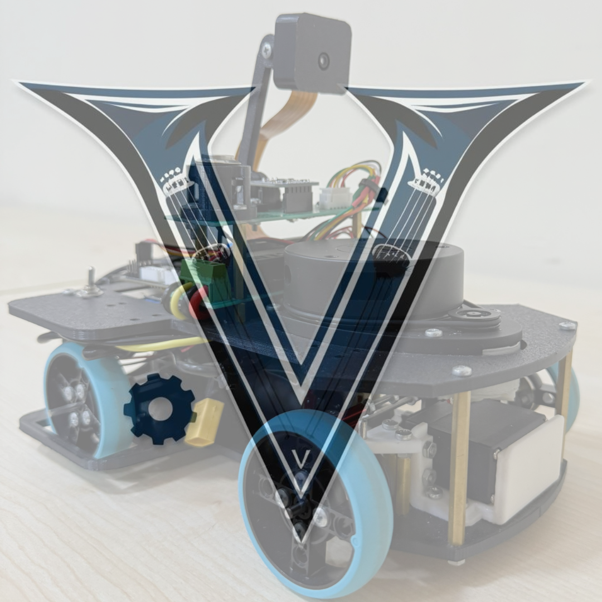

**This README.md file contains our team report on all electronic components used, required software and mechanical design of our robot.**

<table cellspacing="0" cellpadding="0" style="margin:0; padding:0; border-collapse:collapse;">
  <tr>
    <td style="margin:0; padding:0;"><br></td>
    <td>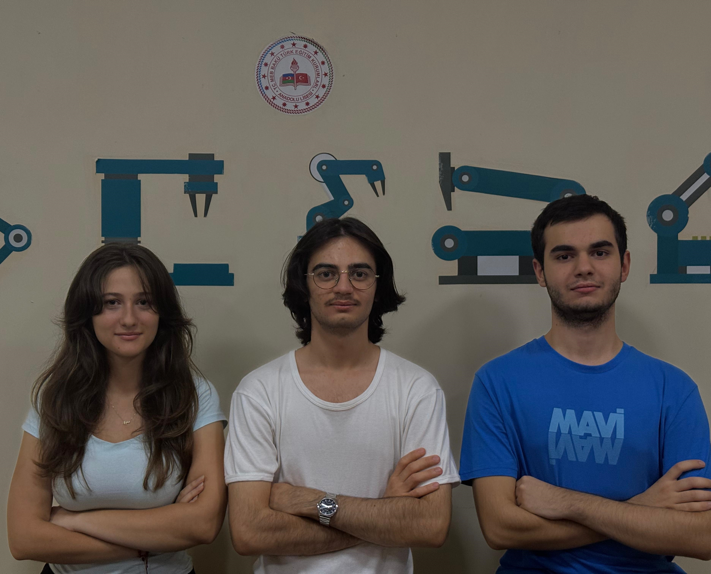<br></td>
  </tr>
</table>

Our team consists of **Əhməd Qəmbərli** (Coding, Planning strategy, [ehmedqemberli09](mailto:ehmedqemberli09@gmail.com), rightmost in the official photo), **Melisa Yıldız** (General Design, [melisa.17.yildiz](mailto:melisa.17.yildiz@gmail.com), center in the official photo) and **Eyüp Şenal** (Electronics, Mechanics, Printing, Market research for used materials, [www.eyup.senal](mailto:www.eyup.senal@gmail.com), leftmost in the official photo). All of our team members have prior WRO experience in different categories.

### Table of contents

- [Introduction](#introduction)
- [Report of used materials](#report-of-used-materials)
  - [Design materials](#design-materials)
  - [Electronic materials](#electronic-materials)
    - [Sensors](#)
    - [Motors](#)
- [Robot setup](#robot-setup)
  - [Printing 3D pieces](#printing-3d-pieces)
  - [Electronic setup](#electronic-setup)
- [Programming Environment Setup](#programming-environment-setup)
  - [Raspberry OS configuration](#raspberry-os-configuration)
  - [Installing used modules](#installing-used-modules)
  - [Running & Testing Code](#running--testing-code)
- [Explanation of Strategy](#explanation-of-strategy)
- [Photos & Videos of robot](#photos--videos-of-robot)


## Introduction

Our robot and software are designed to compete at WRO 2025 Future Engineers. We started working 2-3 months prior to the local competition. All the details are provided in the report below.

## Report of used materials
### Design materials

...

### Electronic materials

...

## Robot setup
### Printing 3D pieces

You can find all design materials inside the models folder. Colors of the components are up to you to choose as they don't effect the behaviour of our robot.

### Electronic setup

...

## Programming Environment setup
### Raspberry OS Configuration
>Make sure to insert an SD card of size at least 16GB to your computer. We will use it as our destination for installation.

We are using Ubuntu Server 24.04.3 LTS (64-bit) as our primary OS in Raspberry Pi. You can flash this OS any way you want but recommended way is to use [Raspberry Pi Imager tool](https://www.raspberrypi.com/software/) from the official website.

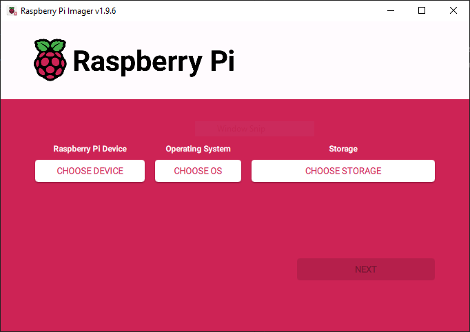

After choosing the device click to "Choose OS". Then `Other general-purpose OS` > `Ubuntu` > `Ubuntu Server 24.04.3 LTS (64-bit)`

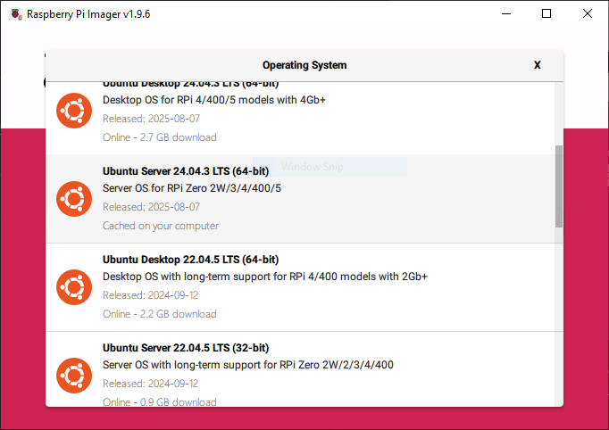

>Ubuntu Server 24.04.3 LTS (64-bit) is the latest server release of Ubuntu. Yet it is already supporting a wide variety of Raspberry Pi versions you can also install another release of Ubuntu Server if you need. But the recommended release is Ubuntu Server 24.04.3 LTS (64-bit) as we were testing with it.

>P.S. Raspberry Pi OS is not working for this project as we will be installing `ROS2 Jazzy` (which is not supportted in Raspberry Pi OS).

Now to Configure the OS you should press `Ctrl` `Shift` `X` / `⌘` `Shift` `X`. Under the `General` tab set up hostname, username and password; configure wireless LAN and also set the locale settings. Then switch to `Services` tab and enable SSH and password authentication. Save your configuration and now you are ready to install the OS (press `Next` button).

After doing the installation it is most recommended to run commands:
```bash
$ sudo apt update
$ sudo apt upgrade
```
### Installing used modules
You need to build packages `rpicam-apps` and `libcamera` from source. Also make sure to install `ROS2 Jazzy` on your Raspberry Pi. After installing `ROS2 Jazzy` install `camera_ros`, `rplidar_ros` ros packages. Now you are ready to run our code.
### Running & Testing Code

To run the code you need to clone our repository:

```bash
$ git clone https://github.com/coolboy19521/Voltivarius.git
$ cd Voltivarius/src
```

If you list all the files you will find 3 programs:

```bash
$ ls
future_engineers.py color_selector.py vizualiser.py
```

First of these files (`future_engineers.py`) is script which we are using for our runs and it should be run on the Raspberry PI itself.

Second of these files (`color_selector.py`) is used for adjusting the [HSV values](https://en.wikipedia.org/wiki/HSL_and_HSV) of colors. This script should be run on the development environment. **Important, you should have ROS2 installed on your development environment. You can follow exactly the same steps as you did for Raspberry if you are using a Linux system. But if you are on Windows or Mac please refer to this tutorial: [Windows](https://docs.ros.org/en/crystal/Installation/Windows-Install-Binary.html), [Mac](https://docs.ros.org/en/crystal/Installation/macOS-Install-Binary.html). Unfortunately, we are not able to give you instructions ourselves as we did not test on Windows and Mac platforms.**

Finally, the last file (`vizualiser.py`) is used to vizualize what robot is seeing at any given time. You should run this program on your development environment as well. **Make sure ROS2 is installed on your system.**
## Explanation of Strategy

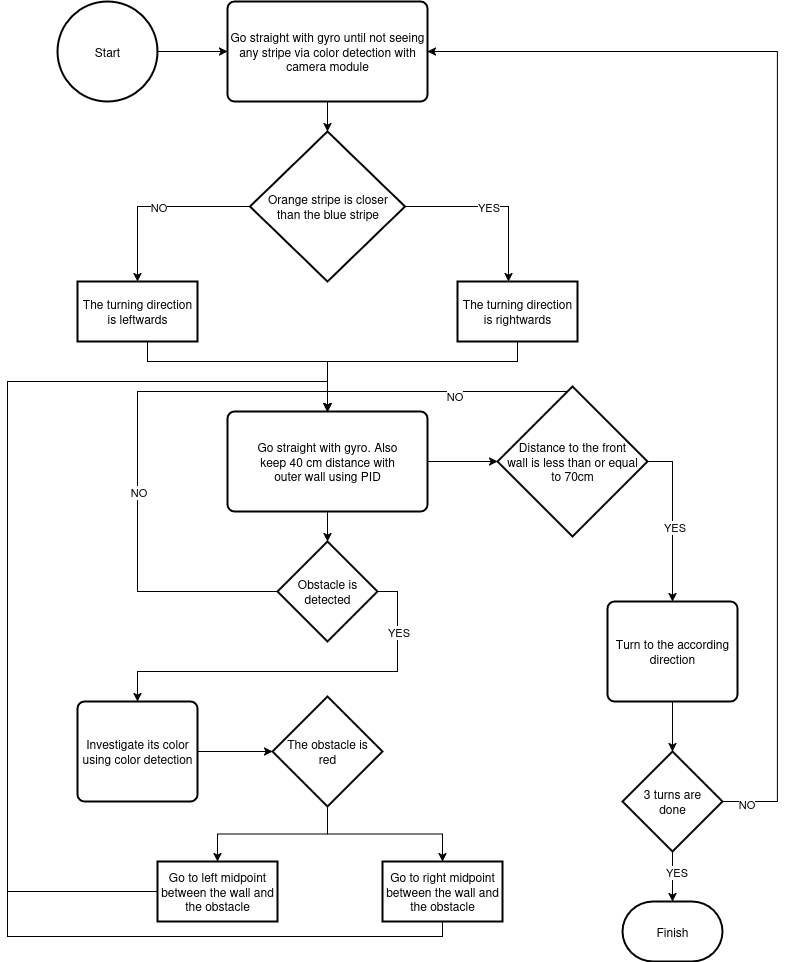
## Photos & Videos of robot
<table cellspacing="0" cellpadding="0" style="margin:0; padding:0; border-collapse:collapse;">
  <tr>
    <td align="center" colspan="2">
      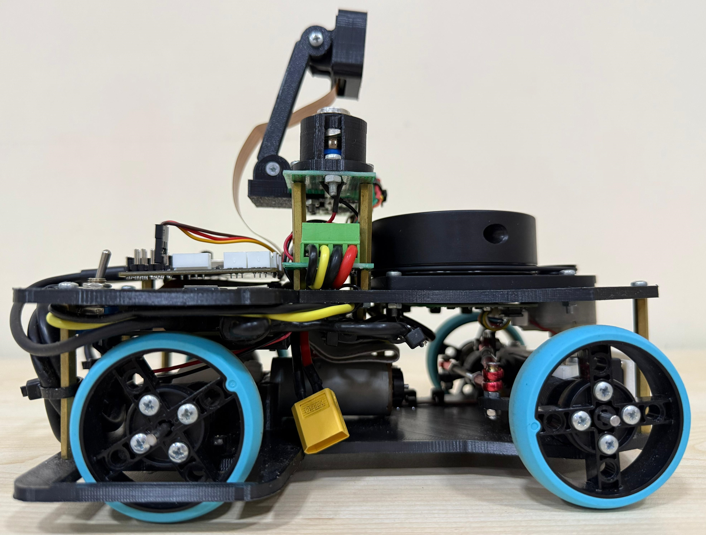<br>
      <b>Right</b>
    </td>
    <td align="center" colspan="2">
      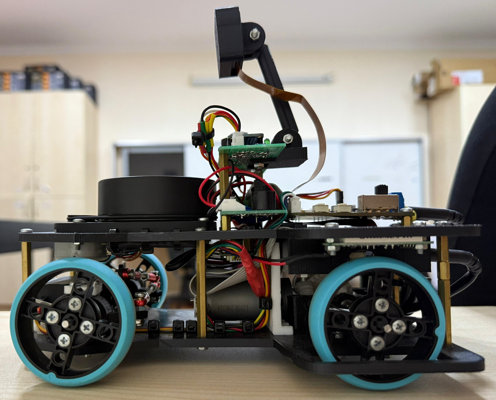<br>
      <b>Left</b>
    </td>
  </tr>
  <tr>
    <td align="center">
      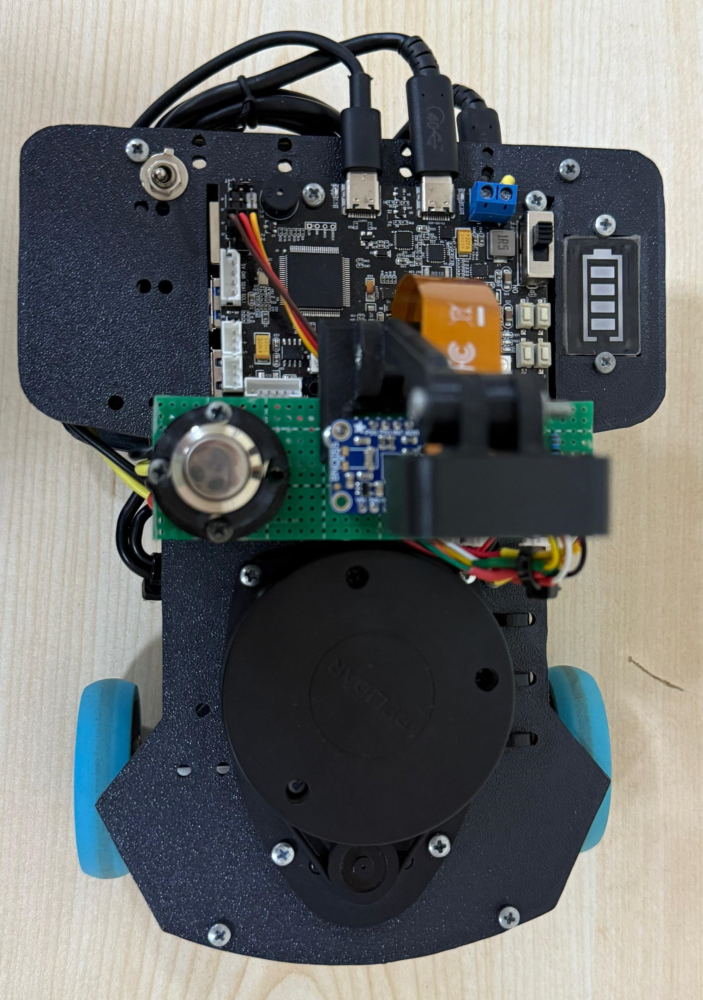<br>
      <b>Up</b>
    </td>
    <td align="center">
      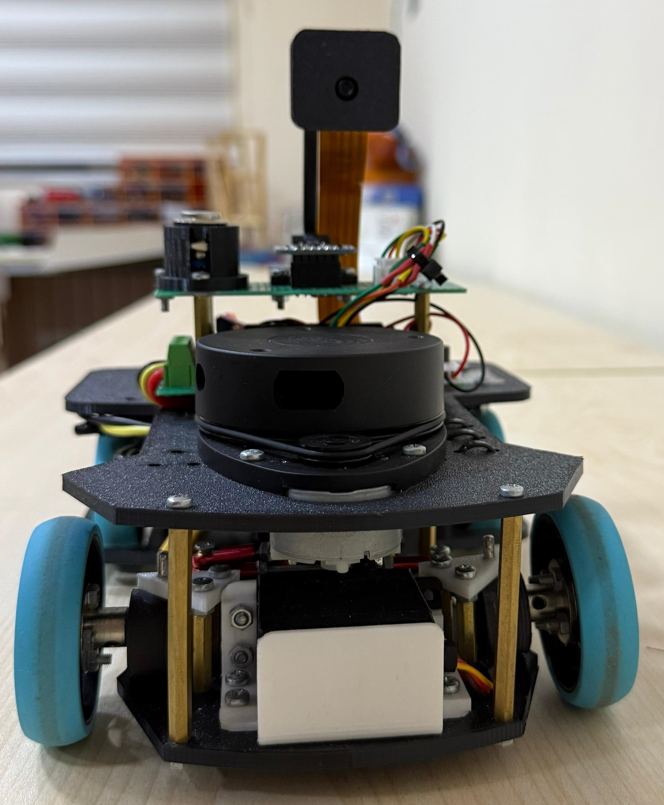<br>
      <b>Front</b>
    </td>
    <td align="center">
      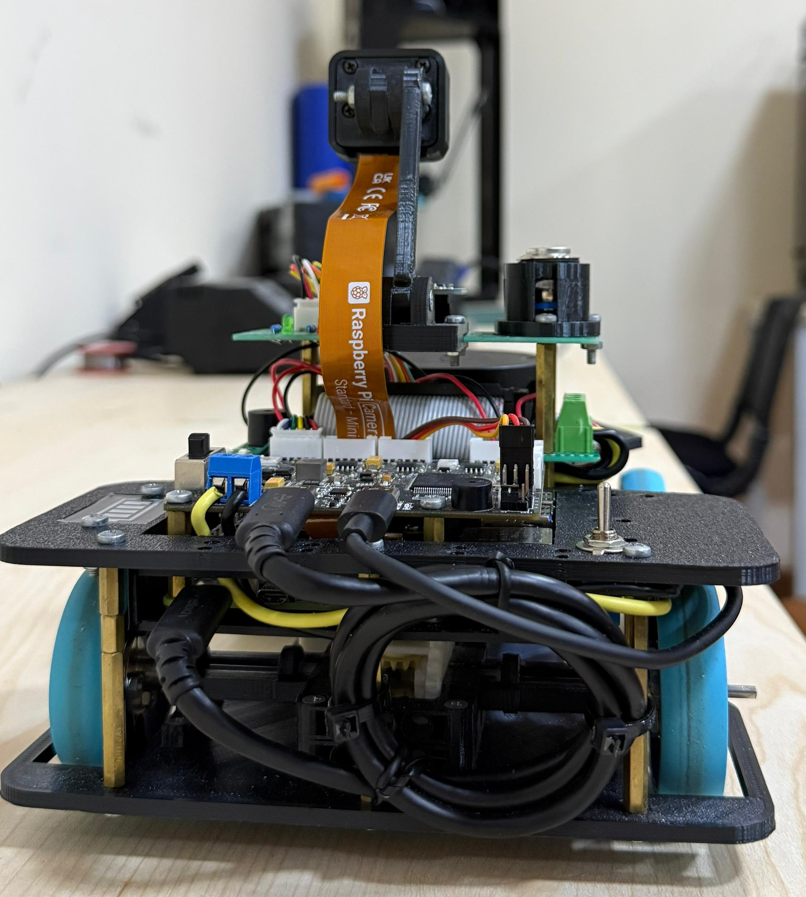<br>
      <b>Back</b>
    </td>
    <td align="center">
      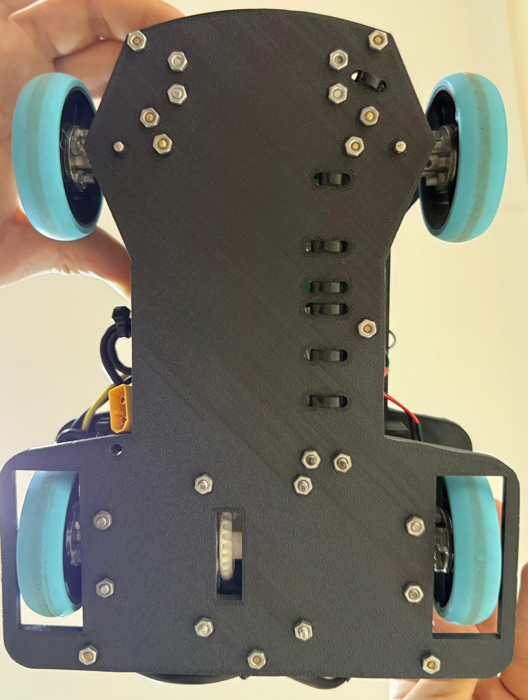<br>
      <b>Down</b>
    </td>
  </tr>
</table>

[](https://www.youtube.com/watch?v=AVoUPSBA6hs)
[](https://www.youtube.com/watch?v=ACrtoZzavfY)